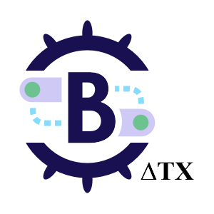

# Brigade Noisy Neighbor


[](https://codecov.io/gh/brigadecore/brigade-noisy-neighbor)
[](https://goreportcard.com/report/github.com/brigadecore/brigade-noisy-neighbor)
[](https://kubernetes.slack.com/messages/C87MF1RFD)



This is a work-in-progress component that emits events (noise) into a Brigade 2
installation's event bus at a configurable frequency. This is useful for
applying load to a Brigade 2 installation for testing purposes or to gain
operational insight.

<br clear="left"/>

## Getting Started

Follow these steps to get started.

### Prerequisites

An operational Brigade 2 installation is a prerequisite.

If necessary, please refer to
[Brigade 2's own getting started documentation](https://github.com/brigadecore/brigade/tree/v2)
for guidance in fulfilling this dependency.

Once Brigade 2 is operational, create a service account for use by Brigade
Noisy Neighbor:

```console
$ brig service-account create \
    --id brigade-noisy-neighbor \
    --description "Used by Brigade Noisy Neighbor"
```

This command will display a token that Brigade Noisy Neighbor can use for
authenticating to the Brigade 2 API server. Take note of this value. It will be
required in subsequent steps and cannot be retrieved later through any other
means.

Now grant the service account permission to create events from the
`github.com/brigadecore/brigade-noisy-neigbor` source:

```console
$ brig role grant EVENT_CREATOR
    --service-account brigade-noisy-neighbor \
    --source github.com/brigadecore/brigade-noisy-neigbor
```

### Installing Brigade Noisy Neighbor

For now, we're using the [GitHub Container Registry](https://ghcr.io) (which is
an [OCI registry](https://helm.sh/docs/topics/registries/)) to host our Helm
chart. Helm 3.7 has _experimental_ support for OCI registries. In the event that
the Helm 3.7 dependency proves troublesome for users, or in the event that this
experimental feature goes away, or isn't working like we'd hope, we will revisit
this choice before going GA.

First, be sure you are using
[Helm 3.7.0](https://github.com/helm/helm/releases/tag/v3.7.0) or greater and
enable experimental OCI support:

```console
$ export HELM_EXPERIMENTAL_OCI=1
```

Use the following command to extract the full set of configuration options from
the chart. Here we're storing a copy at `~/brigade-noisy-neighbor-values.yaml`:

```console
$ helm inspect values oci://ghcr.io/brigadecore/brigade-noisy-neighbor \
    --version v0.2.1 > ~/brigade-noisy-neighbor-values.yaml
```

Edit the configuration (`~/brigade-noisy-neighbor-values.yaml` in this example).
At minimum, you will need to make the following changes:

* Set the value of `brigade.apiAddress` to the address of your Brigade 2 API
  server. This should utilize the _internal_ DNS hostname by which that API
  server is reachable _within_ your Kubernetes cluster. This value is defaulted
  to `https://brigade-apiserver.brigade.svc.cluster.local`, but may need to be
  updated if you installed Brigade 2 in a different namespace.

* Set the value of `brigade.apiToken` to the service account token that was
  generated earlier.

Install Brigade Noisy Neighbor, referencing your edited configuration:

```console
$ helm install brigade-noisy-neighbor \
    oci://ghcr.io/brigadecore/brigade-noisy-neighbor \
    --version v0.2.1 \
    --create-namespace \
    --namespace brigade-noisy-neighbor \
    --values ~/brigade-noisy-neighbor-values.yaml \
    --wait
```

### Subscribing to Noise Events

The Brigade Noisy Neighbor should almost immediately begin emitting events into
your Brigade 2 installation's event bus. This will have no real effect, however,
unless any projects are subscribed to those events.

Here is an example project definition that subscribes to such events:

```yaml
apiVersion: brigade.sh/v2
kind: Project
metadata:
  id: noisy-ned
description: Noisy Ned subscribes to events from the Brigade Noisy Neighbor!
spec:
  eventSubscriptions:
  - source: brigade.sh/brigadecore/brigade-noisy-neighbor
    types:
    - noise
  workerTemplate:
    defaultConfigFiles:
      brigade.js: | 
        const { events, Job } = require("@brigadecore/brigadier");

        events.on("brigade.sh/brigadecore/brigade-noisy-neighbor", "noise", async event => {
          let job = new Job("sleep", "debian:latest", event);
          job.primaryContainer.command = ["sleep"];
          job.primaryContainer.arguments = ["5"];
          await job.run();
        });

        events.process();

```

Besides subscribing to noise events, this project definition also embeds a
`brigade.js` script that will handle such events with a single job that sleep
for five seconds.

Submit this project to Brigade:

```
$ brig project create -f path/to/noisy-ned.yaml
```

## Contributing

The Brigade project accepts contributions via GitHub pull requests. The
[Contributing](CONTRIBUTING.md) document outlines the process to help get your
contribution accepted.

## Support & Feedback

We have a slack channel!
[Kubernetes/#brigade](https://kubernetes.slack.com/messages/C87MF1RFD) Feel free
to join for any support questions or feedback, we are happy to help. To report
an issue or to request a feature open an issue
[here](https://github.com/brigadecore/brigade-noisy-neighbor/issues)

## Code of Conduct

Participation in the Brigade project is governed by the
[CNCF Code of Conduct](https://github.com/cncf/foundation/blob/master/code-of-conduct.md).
